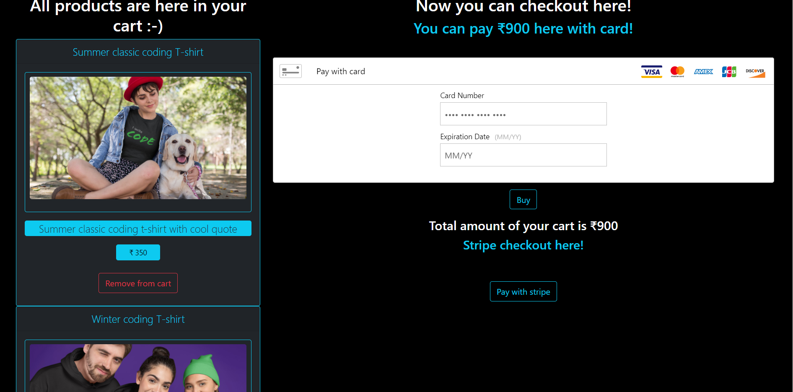

# T-shirt-selling-ecommerce-website
Created an e-Commerce website for T-shirts Used MongoDB, NodeJS and Express for backend Created UI from scratch with React JS and Integrated two payment gateways, Stripe and PayPal

